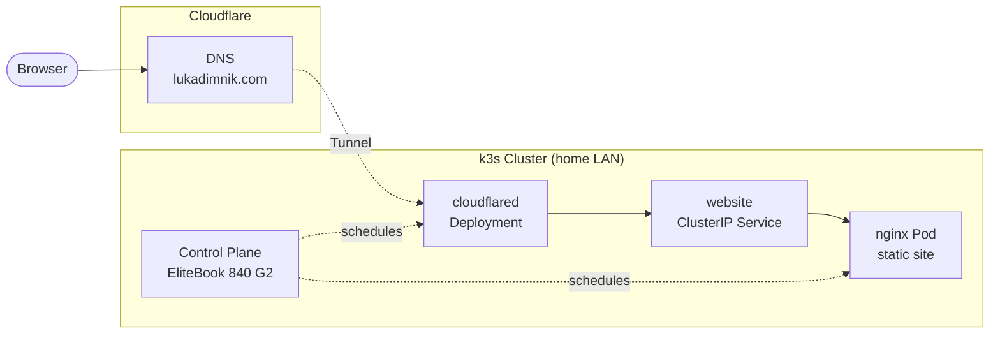

# Homelab

A two-node k3s cluster I'm building as a hands-on DevOps learning project. The cluster hosts my personal site at **[lukadimnik.com](https://lukadimnik.com)** and will grow into a portfolio-grade DevOps showcase.

## Hardware

| HP EliteBook 840 G2
| PC Tower

The PC Tower also carries a **GeForce 1080 Ti** — reserved for future GPU workloads (Ollama, inference). Both machines run **Arch Linux** (Omarchy distribution).

## Architecture

## What's been built

- [x] k3s cluster — EliteBook as control plane, PC Tower as worker node
- [x] Static LAN IPs assigned
- [x] UFW firewall configured with per-IP SSH rules
- [x] Static website containerised with Nginx; image published to Docker Hub
- [x] Website deployed to k3s and verified on the local network
- [x] Source pushed to GitHub
- [x] `lukadimnik.com` registered via Cloudflare Registrar
- [x] `cloudflared` running as a Kubernetes Deployment (in-cluster, credentials stored in a Secret)
- [x] `lukadimnik.com` routed through the Cloudflare Tunnel — no open inbound ports on the home network

## Roadmap

### Stage 1 — CI/CD + TLS
- [ ] GitHub Actions: build → Trivy vulnerability scan → push with git-SHA tag
- [ ] cert-manager with DNS-01 solver for wildcard TLS (`*.lukadimnik.com`)
- [ ] HTTPS-only Ingress with HSTS

### Stage 2 — GitOps with ArgoCD
- [ ] `homelab-gitops` repo with Kustomize base/overlays (`dev` / `prod`)
- [ ] App-of-apps pattern — ArgoCD reconciles all cluster state including itself
- [ ] Goal: rebuild the entire cluster from Git with one command

### Stage 3 — Observability
- [ ] `kube-prometheus-stack` — Prometheus, Grafana, Alertmanager, node-exporter
- [ ] Loki + Promtail for log aggregation
- [ ] Dashboards: website RPS / p95 latency / 5xx rate, cluster CPU/RAM/disk
- [ ] Alerts: pod restarts, disk pressure → Discord or Telegram webhook

### Stage 4 — Secrets hygiene + Ingress hardening
- [ ] Sealed Secrets or External Secrets Operator — no plaintext secrets in Git
- [ ] Traefik middlewares: rate limiting, security headers

### Stage 5 — Stateful workloads
- [ ] Longhorn for distributed block storage with automated snapshots
- [ ] CloudNativePG operator for Postgres
- [ ] One self-hosted app with real persistence (Vaultwarden, Gitea, or Immich)

### Stage 6 — GPU workloads
- [ ] NVIDIA device plugin for Kubernetes
- [ ] Ollama running Llama 3 on the 1080 Ti, scheduled via node affinity
- [ ] Small app consuming the inference endpoint, deployed through ArgoCD

### Stage 7 — IaC for the nodes
- [ ] Ansible playbooks: install k3s, configure UFW, set up SSH keys, join workers
- [ ] Goal: provision a bare-metal node from scratch with a single command

### Stage 8 — Backup and disaster recovery
- [ ] Velero + Backblaze B2 for nightly namespace and PVC backups
- [ ] Documented restore drill — delete a namespace, restore from backup, write the runbook

### Stage 9 — HA control plane
- [ ] Three-node control plane with embedded etcd (after mini PC purchase)
- [ ] Document etcd snapshots and graceful node drains

---

*Built for learning — every component set up by hand.*
